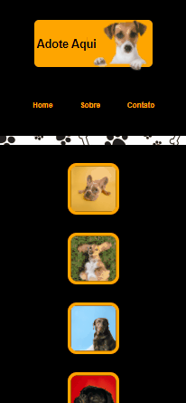

<h1>Projeto Adote Aqui!</h1>

Este foi o primeiro projeto desenvolvido no bootcamp Resilia Educação - Web Dev Full Stack. Para o desenvolvimento, foram utilizadas as linguagens HTML e CSS. O objetivo foi criar uma página para adoção de animais e testar os conhecimentos de Flexbox.

<h2>Desktop</h2>

<h2 align="center">Mobile</h2>

 

> Status do projeto: Sujeito a melhorias.

<h2>Documentação e Referências</h2>

<ul>
  <li><a href="https://developer.mozilla.org/pt-BR/docs/Learn/CSS/CSS_layout/Flexbox">Flexbox</a></li>
</ul>

<h2>GitHubs Pages é logo ali...</h2>

 

<strong>Desenvolvido por <a target= "_blank" href="https://www.linkedin.com/in/cibele-martins-85b910169/">Cibele Martins</a>.</strong>
